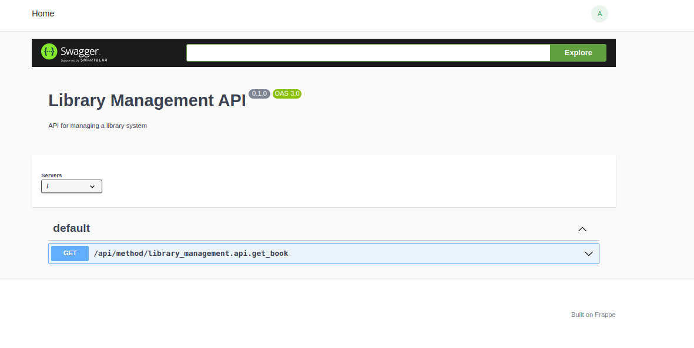

# FrappeAPI

Build APIs for Frappe with the simplicity of FastAPI!

⚠️ **Alert: Beta Version**

This project is currently in beta and not yet ready for production use. Expect changes and improvements as we work towards a stable release.

## Usage

Here's an example of how to use FrappeAPI in a Library Management app:

=== "FrappeAPI Approach"

    ```python
    from frappeapi import FrappeAPI
    from pydantic import BaseModel

    app = FrappeAPI()

    class Book(BaseModel):
        title: str
        author: str
        isbn: str
        available: bool

    @app.get(response_model=Book)
    def get_book(isbn: str):
        # In a real application, you would fetch this data from the database
        book = {
            "title": "To Kill a Mockingbird",
            "author": "Harper Lee",
            "isbn": "9780446310789",
            "available": True
        }
        return book

    ```

=== "Traditional Frappe Approach"

    ```python
    import frappe
    from frappe import _

    @frappe.whitelist(methods=["GET"])
    def get_book(isbn):
        # In a real application, you would fetch this data from the database
        book = {
            "title": "To Kill a Mockingbird",
            "author": "Harper Lee",
            "isbn": "9780446310789",
            "available": True
        }
        return book
    ```

!!! note "Key Differences"
    - **Type Hinting**: FrappeAPI uses Pydantic models for automatic request/response validation.
    - **Documentation**: FrappeAPI automatically generates OpenAPI documentation.
    - **Response Handling**: FrappeAPI automatically serializes responses to JSON.
    - **Query Param Validation**: FrappeAPI validates query parameters based on function signatures i.e `isbn` parsed and validated as `str`
    - **Consistent Error Handling**: FrappeAPI provides a consistent error handling mechanism.
    - ... and more to be discovered...

## Configuring Auto-Generated OpenAPI Documentation

To configure auto-generated OpenAPI documentation for your Frappe application, follow these steps:

1. Create a `docs` directory inside `your_app/templates/pages`.

2. Create an `index.html` file inside the `docs` directory with the following content:

    ```html
    

     OpenAPI Documentation 

    
    <meta charset="UTF-8">
      <title>Swagger UI</title>
      <link href="https://fonts.googleapis.com/css?family=Open+Sans:400,700|Source+Code+Pro:300,600|Titillium+Web:400,600,700" rel="stylesheet">
      <link rel="stylesheet" type="text/css" href="https://cdnjs.cloudflare.com/ajax/libs/swagger-ui/5.9.4/swagger-ui.css" >
      <style>
        html {
          box-sizing: border-box;
          overflow: -moz-scrollbars-vertical;
          overflow-y: scroll;
        }
        *, *:before, *:after {
          box-sizing: inherit;
        }
        body {
          margin:0;
          background: #fafafa;
        }
      </style>
    

    
    <div id="swagger-ui"></div>
    <script src="https://cdnjs.cloudflare.com/ajax/libs/swagger-ui/5.9.4/swagger-ui-bundle.js"> </script>
    <script src="https://cdnjs.cloudflare.com/ajax/libs/swagger-ui/5.9.4/swagger-ui-standalone-preset.js"> </script>
    <script>
      var spec = {{ data }}
      const ui = SwaggerUIBundle({
        spec: spec,
        dom_id: '#swagger-ui',
        deepLinking: true,
        presets: [
          SwaggerUIBundle.presets.apis,
          SwaggerUIStandalonePreset
        ],
        plugins: [
          SwaggerUIBundle.plugins.DownloadUrl
        ],
        layout: "StandaloneLayout"
      })
    </script>
    
    ```

3. Create an `index.py` file inside the `docs` directory with the following content:

    ```python
    # import FrappeAPI app
    from library_management.api import app

    def get_context(ctx):
        ctx.data = app.openapi_json()
    ```

This setup will render the Swagger UI with your OpenAPI specification when you navigate to the `127.0.0.1:8000/docs` URL in your application.


